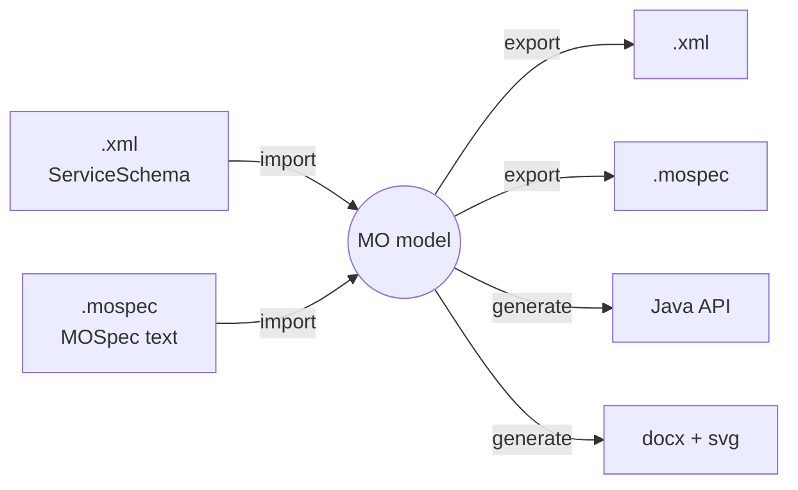

# api-generator-lib — Design

Status: **proposal** · New module: 14.x · Cut-over: **v15.0**

`api-generator-lib` is built and matured **alongside** `generator-interfaces`, `generator-java` and
`generator-docs`, which stay in place and keep driving the build throughout 14.x. The three old
modules are removed only at the v15.0 cut-over (§10.3). Nothing in 14.x depends on the new library
being finished.

## 1. Purpose

Introduce a single library, `api-generator-lib`, holding **our own data model** of MO service
specifications, with pluggable importers, exporters and generators around it:



The model is the centre. Formats and outputs are peripheral and independently replaceable.

## 2. What is wrong today

The current generators do not have a data model of their own. They operate directly on JAXB
classes generated by `xjc` from `ServiceSchema-v003-backwards-compatible-hybrid.xsd` at build
time, and those classes are populated either by JAXB unmarshalling or by a third-party library.
Concretely:

| Symptom | Evidence |
| --- | --- |
| The model is a build artifact | `generator-interfaces/pom.xml` runs `jaxb2-maven-plugin:xjc` twice, to `esa.mo.xsd` and `w3c.xsd`. The classes exist only in `target/`. |
| The model shape is dictated by XSD | `OperationType` subclasses per interaction pattern, `getSendIPOrSubmitIPOrRequestIP()`, `JAXBElement` wrappers, `getAny()` lists. |
| A second, derived model exists to compensate | `OperationSummary`, `ServiceSummary`, `FieldInfo`, `CompositeField`, `TypeKey` — built by walking the JAXB tree, then passed to the generators instead of it. |
| Target-language data sits in the "neutral" layer | `GeneratorBase` owns `AttributeTypeDetails`, `NativeTypeDetails`, package bindings — all Java-specific. |
| A third copy of the model arrives with MOSDL | `mosdl-0.1.1.jar` ships its own `ServiceSchema.xsd`, `COMSchema.xsd`, `bindings.xjb` and `org.ccsds.schema.serviceschema.*` classes — an older, divergent snapshot of the same schema. |
| Format hacks patch over the mismatch | `XmlSpecification.modifyFileToBeBackwardsCompatible()` string-replaces `ServiceSchema-v003` → `ServiceSchema` before parsing. `ParserMOSDL.parseMOSDL()` string-replaces `/**` → `"""` before parsing. |

Scale of the code involved: ~15.3k lines across the three modules, the largest units being
`GeneratorLangs` (1754), `GeneratorDocx` (1176), `GeneratorSvg` (1155), `JavaConsumer` (961);
plus `MosdlSpecLoader` (1247) and `GeneratorMOSDL` (972) vendored into `mo-navigator`.

## 3. Module layout

```
api-generator/
├── api-generator-lib/            NEW  — model, all import/export, all generators
├── api-generator-maven-plugin/   kept — thin Mojo, drives both paths during 14.x
├── generator-interfaces/         kept through 14.x, deleted at v15.0
├── generator-java/               kept through 14.x, deleted at v15.0
└── generator-docs/               kept through 14.x, deleted at v15.0
```

**One new module, not several.** Model, XML, MOSpec, Java, docx and svg all live in
`api-generator-lib`. Splitting the text format into its own artifact was considered and rejected:
the only argument for it was isolating a parser dependency, and since the MOSpec parser is
hand-written (§7.2) there is no dependency to isolate. One library is the point of the exercise.

All five modules are in the reactor at once during 14.x. What makes that painless is the new root
package `esa.mo.apigen` (below) — no class, package or artifact name collides with the old modules,
so both can sit on the same classpath.

`parent/pom.xml:367` keeps its `generator-java` dependency throughout 14.x. Swapping it for
`api-generator-lib` **is** the cut-over and happens once, in v15.0.

### Running both in parallel

Throughout 14.x the new path can be **exercised end to end** — up to and including building every
`apis/*` module through the new library, compiling the result and running the full test suite —
while the **default stays the old generators**. A clean checkout, and every release cut from 14.x,
builds exactly as it does today. Flipping that default is the cut-over, and it happens once, at
v15.0 (§10.3).

The plugin already selects a generator by short name, so the new generators register under distinct
names. Making the choice a property turns a per-module edit into a whole-build switch —
`parent/pom.xml:356` currently hardcodes it:

```xml
<targetLanguages>
    <targetLanguage>${esa.stubgen.generator}</targetLanguage>
</targetLanguages>
```

with `esa.stubgen.generator` defaulting to `Java` (the old path) and a profile selecting the new
one. Three ways to exercise it then fall out of the same mechanism:

- **one module** — override the property in that module's pom, for a first pilot;
- **the whole build** — `mvn -Pnew-generator install`, which is what CI runs as a second job;
- **both, compared** — build each way and diff the two `generated-sources/stub` trees, which is the
  golden-tree check (§10.1) applied to a live build rather than a stored snapshot.

That last one is the strongest form of the parallel-run contract, and it is why the two
implementations coexisting is worth the duplication rather than merely tolerable.

Cost to accept for the duration: fixes made to the old generators must be mirrored into the new
ones, or the difference consciously accepted. Running both in CI is what keeps that honest — a
change to either side that moves the output shows up as a diff on the next build.

**Dependencies:** `api-generator-lib` has **zero** third-party dependencies — the model is plain
Java, XML I/O uses StAX from the JDK, the MOSpec parser is hand-written (§7.2), and docx/svg output
is written as text. This removes `jaxb-api`, `jaxb-runtime`, `activation`, `reflections`,
`maven-plugin-api`, `de.dlr.gsoc.mcds:mosdl` and both `xjc` executions. Keeping the library
dependency-free is what makes putting everything in it cost nothing.

`api-generator-maven-plugin` stays a separate module — it is the Maven binding, not part of the
library, and it must go on depending on the old generators throughout 14.x.

**Java level: 1.8**, matching `parent/pom.xml`. No records, no sealed types, no `var`. The Maven
plugin has to run under whatever JDK a consumer builds with, so raising the level here would raise
the floor for everyone building the project. Revisit separately from this work.

The build-time XSD download from `xml-ccsds-mo-standards` / `-prototypes` stays, but its purpose
changes completely: the schemas are copied in as **resources for validating output** (§6.1), not
fed to `xjc` to generate the model. Nothing is code-generated from them any more.

### Package layout

```
esa.mo.apigen
├── model/          Specification, MOModel, Area, Service, CapabilitySet,
│                   Operation, MessageBody, Field, ErrorDefinition, ErrorReference
│   ├── types/      TypeDefinition → Fundamental|Attribute|Composite|Enumeration, TypeRef
│   ├── com/        COMFeatures, COMObject, ObjectReference
│   └── docs/       Documentation, Diagram
├── validation/     Validator, ValidationIssue, SourceLocation
├── importers/      Importer (SPI)
│   ├── xml/        XmlImporter
│   └── mospec/     MOSpecImporter, MOSpecLexer, MOSpecParser
├── exporters/      Exporter (SPI)
│   ├── xml/        XmlExporter
│   └── mospec/     MOSpecExporter, SourceFormatter
└── generators/     Generator (SPI), java/, docx/, svg/
```

A new root package (`esa.mo.apigen`, not `esa.mo.tools.stubgen`) so old and new coexist during
migration.

### Four invariants

1. **`model/` imports nothing but `java.*`.** No JAXB, no StAX, no ANTLR. Importers own their
   parsing technology; nothing of it escapes into the model.
2. **No target-language data in the model.** `AttributeTypeDetails`, `NativeTypeDetails`, package
   bindings and reserved words move into `generators/java/`.
3. **Import is lenient; validation is separate.** Importers record a `SourceLocation` on every
   element and never throw on semantic problems. `Validator` reports issues with locations. This is
   what makes the editor's lax mode fall out of the design rather than being a special path.
4. **There is no configuration.** The working assumption is that none is needed. If a real need
   appears later, an option gets added then, for that need.

The fourth is not a matter of taste. The existing plugin exposes **fourteen** options —
`generateStructures`, `generateCOM`, `forceGeneration`, `packageBindings`, `xsdRefDirectory` and the
nine `extraProperties` keys (§5.2) — and **every one of them sits at its default in every pom in
this repository**. A pom is written once when a service is added and then never touched again, so
each option is pure surface: something to document, thread through five call signatures, test, and
keep working, in exchange for behaviour nobody has ever selected.

Removing them is provably safe rather than a judgement call. The golden tree (§10.1) was produced
with exactly those defaults, so writing each default into the code is byte-for-byte
output-preserving, and the harness verifies it.

What remains are **arguments, not options**: where the specifications are, where the output goes,
which of them are generation targets rather than references, and which generator to run. A caller
has to supply those or there is nothing to do; none of them selects between behaviours. So the
library has no configuration surface at all — no config object, no properties map, no `init` phase.

This is the same reasoning as §8.1 on adding a target language. Both resist generalising ahead of a
real case, because each generalisation made in advance is a guess, and the current code is what the
guesses accumulated into. Adding an option later, once someone actually needs it, is a small and
well-informed change; carrying fourteen that nobody needs is a permanent tax.

## 4. The data model

```java
Specification { List<Area> areas;              // one file; today always exactly one area,
                SchemaVersion schemaVersion;   //   but the schema permits several — keep the list
                String comment;                // <mal:specification comment="…">
                SourceRef source; }

MOModel {                                      // all loaded specs + index
    List<Specification> specifications;
    TypeDefinition resolve(TypeRef);           // self-contained — see §4.1
    COMObject      resolve(ObjectReference);
    Area           findArea(AreaKey key);      // (name, number, version)
}

Area { int number, version; String name, comment;
       Specification specification;                           // back-reference
       List<Service> services; List<TypeDefinition> dataTypes;
       List<ErrorDefinition> errors; Documentation documentation; }

Service { int number; String name, comment;
          Area area;                                           // back-reference
          List<CapabilitySet> capabilitySets;
          List<TypeDefinition> dataTypes;                      // v001 only  ⟵ §4.5
          List<ErrorDefinition> errors;                        // v001 only  ⟵ §4.5
          COMFeatures com; Documentation documentation; }

CapabilitySet { int number; String comment; List<Operation> operations; }

Operation { String name; int number; String comment;
            boolean supportInReplay;                           // v001 only  ⟵ §4.5
            InteractionPattern pattern;                        // SEND … PUBSUB
            Map<InteractionStage, MessageBody> messages;       // SUBSCRIPTION_KEYS is v003 only
            List<ErrorReference> errors;
            Documentation documentation;                       // v003 only  ⟵ §4.5
            CapabilitySet parent; }

MessageBody { String comment; List<Field> fields; }
Field       { String name, comment; boolean canBeNull; TypeRef type; }

TypeRef { String area; int areaVersion;        // version filled in at import — §4.1
          String service;                      // v001 only  ⟵ §4.5
          String name;
          boolean isList;
          boolean isObjectRef; }               // v003 only  ⟵ §4.5   (value object)
```

The model is the **union of the two schema versions** (§4.5); fields marked above exist in only
one. Nothing is conditional at the type level — a v003 model simply leaves `supportInReplay` at its
default — but the exporter refuses to write a field the target version does not have, rather than
dropping it.

`Operation` carrying its own body is the change that removes `OperationSummary`, `ServiceSummary`
and `FieldInfo` — today's derived shadow model. `TypeRef` with proper `equals`/`hashCode` subsumes
`TypeKey`. Back-references (`Service.getArea()`) remove the parameter tunnelling that produces
signatures like `processService(File, AreaType, ServiceType, …)`.

**The model captures what the specifications say, and nothing about what anyone intends to do with
them.** In particular there is no "is this a generation target" flag anywhere in §4. A build loads
more specifications than it generates — `apis/api-area003-v001-common` declares Common as its
target and MAL and COM as references:

```xml
<ccsds.specification.download.filter>**/area003-v001-Common.xml</ccsds.specification.download.filter>
<ccsds.specification.download.ref-filter>**/area001-v003-MAL.xml, **/area002-v001-COM.xml</ccsds.specification.download.ref-filter>
```

Common needs MAL loaded so `MAL::Identifier` resolves, but must not emit MAL's Java classes — those
already ship in the `api-area001-v003-mal` artifact it depends on, and generating them again puts
the same classes on the classpath twice.

But that is a fact about *this build*, not about the file: the same `area001-v003-MAL.xml` is a
reference here and the target in `apis/api-area001-v003-mal`. Recording it on `Specification` would
make two builds produce different models from identical input, and would add a field that neither
format can represent. So the model holds every loaded specification identically, all imported,
linked and validated the same way, and **the caller says what to generate** by passing the target
areas to `Generator.generate` (§5.2).

`Specification.areas` stays a list even though every file in the corpus contains exactly one area.
The schema allows more, and multi-area files are considered a live possibility — so nothing may
assume one. For MOSpec export that means a multi-area specification produces one `.mospec` per
area into the output directory (§5.2).

### 4.1 Area identity and version resolution

Areas already carry a `version` attribute (`<mal:area name="MAL" number="1" version="3">`). What
*cross-area type references* lack is any version at all:

```xml
<xsd:complexType name="TypeReference">
  <xsd:attribute name="area" .../> <xsd:attribute name="name" .../>
  <!-- no version -->
</xsd:complexType>
```

So `<mal:type area="MAL" name="Blob"/>` does not say which MAL. The missing information is supplied
by the **referencing file's schema namespace**, which every specification in the corpus declares:

```xml
<mal:specification xmlns:mal="http://www.ccsds.org/schema/ServiceSchema-v003">
```

`Specification.schemaVersion` carries which schema the file conforms to. That governs which
constructs are legal in it (§4.5), and it is also what a MAL reference resolves against.

**A reference to the MAL means the MAL of the referring specification's own generation.**
That is the one thing in a file which says so: the namespace it declares. A document in the
`ServiceSchema` namespace is written against MAL 1 and one in `ServiceSchema-v003` against MAL 3,
and everything in it follows — v001 raises `UNKNOWN`, v003 raises `Unknown`, and the two carry
different numbers as well as different names, because v001 read errors as codes and v003 reads them
as exceptions. Pair a specification with the MAL of its generation and every reference in it
resolves; pair it with the other and none of the renamed errors does.

Any other area is taken to be whichever version of it is loaded, there being nothing in a reference
to say otherwise. If two versions of such an area are loaded the reference is genuinely ambiguous,
and the validator reports it against the referencing element.

The six specifications still on the v001 schema are nonetheless **built** against MAL v3, because
`api-area001-v003-mal` is the only MAL with a Java API. That is a fact about the build rather than
about any file, so the validator states it once for each specification (§9) instead of once for
every name that does not match.

**The version is written into the `TypeRef` at import**, not supplied at every lookup — the importer
fills in `areaVersion` from the generation above, or from the loaded area, as it reads each
reference.

Doing it at import rather than at lookup matters for three reasons:

- `TypeRef` is a value object used as a map key. If the version lived outside it,
  `MAL::Blob`-from-v1 and `MAL::Blob`-from-v3 would compare **equal** while resolving to different
  definitions — a latent bug in anything keyed by `TypeRef`.
- `TypeRef` is carried by every field, message body, `extends` clause and error extra-information
  element. Threading a `Specification from` through every resolution call is the same parameter
  tunnelling this design removes elsewhere.
- Resolution then belongs to a **link step**, run as part of validation (§5.1): after it, every
  reference in the model is resolved and the model is fully immutable, which is what §8.2's
  parallelism relies on. Generators never call `resolve` at all — they follow an already-linked
  reference.

The exporter writes the unversioned form back, since the schema has no version attribute on a type
reference; nothing is lost, because the version is recoverable from the specification's own schema
version on the next import.

This is also what turns `XmlSpecification.modifyFileToBeBackwardsCompatible()` from a hack into
data: the namespace stops being something to string-replace away and becomes a field.

**Area identity is not unique, and the model must say so rather than silently overwrite.** Three
real collisions exist in `xml-service-specifications` today:

| Collision | Files |
| --- | --- |
| Identical `name="COM" number="2" version="1"` on two different specs | `area002-v001-COM.xml`, `area002-v002-Basics.xml` |
| Same number 9, different names — `MPD` vs `distribution` | `area009-v001-…`, `area052-v001-…` |
| Same name `MC`, different numbers — 4 vs 104 | `area004-v001-…`, `area104-v001-…` |

None of these is reachable today: each `apis/*` module names the specifications it loads explicitly
— at most a target plus two references — and none of the three colliding files is referenced by any
module. But a `Map` keyed on area name, which is what the current registry effectively does, would
resolve a future pairing by last-one-wins and silently. `MOModel` therefore keys on
`AreaKey(name, number, version)` and reports a conflicting identity as a `WARNING` naming both
source files (§5.3).

`area002-v002-Basics.xml` is a separate matter: it declares `name="COM" number="2" version="1"`,
identical to `area002-v001-COM.xml`, because it began as a copy of it. Nothing references it. It is
a candidate for deletion rather than something the validator needs to accommodate.

### 4.2 Where the MAL attribute types come from

Today there are two sources of truth. `GeneratorJava` hardcodes all nineteen:

```java
addAttributeType(StdStrings.MAL, StdStrings.BLOB,    false, "Blob",    "");
addAttributeType(StdStrings.MAL, StdStrings.BOOLEAN, true,  "Boolean", "Boolean.FALSE");
```

while `area001-*-MAL.xml` declares the same types as `<mal:attribute>` elements — and the two are
merged into one registry, so it is not obvious which one is authoritative.

The split follows §3's second invariant. The **model** takes the attribute types from the loaded MAL
specification, in the version selected by §4.1. The **Java generator** holds only the Java-side
mapping keyed by type name — target type, native-or-not, default value — and nothing that
identifies the type itself. If MAL is not among the loaded specifications, that is an error rather
than a fallback to a built-in table: a model that cannot resolve `MAL::Blob` cannot generate
anything correct, and failing loudly beats generating against a stale hardcoded list.

### 4.3 Type definitions

```java
abstract TypeDefinition { String name, comment;
                          Area area; Service service; }        // back-references; service may be null

FundamentalType  extends TypeDefinition { TypeRef superType; }         // always abstract
AttributeType    extends TypeDefinition { int shortFormPart; }
CompositeType    extends TypeDefinition { Integer shortFormPart;       // null → abstract
                                          TypeRef superType;           // never null — see below
                                          List<Field> fields; }
EnumerationType  extends TypeDefinition { int shortFormPart;
                                          List<Item> items; }
Item { String value, comment; long nvalue; }

ErrorDefinition { String name; long number; String comment; Field extraInformation; }
ErrorReference  { TypeRef error; String comment; Field extraInformation; }
```

A `TypeDefinition` points at its owning `Area` and `Service` rather than naming them as strings,
matching `Service.area` — so the defining area's version is directly available and there is no
second copy of the name to keep consistent. `service` is null for area-level types.

**`CompositeType.superType` is always set.** The XML carries two spellings of one meaning: of 326
composites in the corpus, 215 declare `extends MAL::Composite` explicitly and 23 declare no
`extends` at all, which the schema defines as identical — *"if this is not present then the base
Composite is implied"*. (The remaining 88 extend a genuine supertype.) The importer resolves the
implied case, so the model never holds a null supertype and no reader has to know the rule; both
exporters then write the clause every time.

The consequence is deliberate: on re-export, those 23 composites **gain** an explicit
`<mal:extends>` they did not have. That is an intended difference for §10.1's list — it normalises
a redundancy the schema itself documents, in the direction that leaves nothing implicit.

`CompositeType.isAbstract()` returns `shortFormPart == null` rather than making every caller test
it. Absence is the only thing that means abstract: the schema says so explicitly ("If no short form
part is provided then this is an Abstract composite type"), `ShortFormPart` is `minInclusive="1"` in
every schema version so `0` was never a legal value, and no specification in the corpus uses it.
`GeneratorMOSDL:615` additionally tests `shortFormPart == 0`; that is dead code guarding an
impossible value and is not carried over.

### 4.4 COM

Per decision, COM is **first-class**: `Service` holds `COMFeatures` directly, rather than the XSD's
`ExtendedServiceType` subclass-and-cast arrangement.

The types are named for what they are rather than after the schema: `COMObject` where the XSD says
`ModelObjectType`, and `COMFeatures` for `SupportedFeatures`. `COMObject` covers events too — the
schema's `ModelEventTypeList` holds elements of the same `ModelObjectType` — so an event is a COM
object that happens to live in the `events` list.

```java
COMFeatures { String objectsComment, eventsComment;      // list-level comments, both substantial
              List<COMObject> objects;
              List<COMObject> events;
              String archiveUsage, activityUsage;
              Documentation documentation; }

COMObject { String name; int number; String comment;
            TypeRef bodyType;                            // null → no body
            ObjectLink related, source; }

ObjectLink      { String comment; ObjectReference target; }   // either part may be absent
ObjectReference { String area; int areaVersion;               // as TypeRef — filled in at import
                  String service; int number; }               // numeric — see §7.4
```

`ObjectReference` carries `areaVersion` for exactly the reasons `TypeRef` does (§4.1): the XML
form — `<com:objectType area="COM" number="6" service="ActivityTracking"/>` — has no version, it is
resolved at link time, and it is a value object that would otherwise compare equal across two
versions of the same area.

COM is always modelled and always generated. The old `generateCOM` flag, which skipped the COM
area entirely, is not carried over — it sat at its default `true` in every pom (§3, invariant 4).

### 4.5 Round-trip completeness

`xml → model → xml` has to be lossless, so §4 was audited element by element against
**both** `ServiceSchema.xsd` (v001) and `ServiceSchema-v003.xsd`, and against the corpus. Two
omissions were found and are fixed above:

| Omission | Schema | Corpus |
| --- | --- | --- |
| `Specification.comment` | `<xsd:attribute name="comment">` on `SpecificationType` | used by 4 of 14 specs |
| `Operation.documentation` | `OperationType` extends `DocumentationBaseType` | 36 `<mal:documentation>` elements inside operations in MPD |

**Two constructs the schema allows and nothing uses.** Both are deliberately *not* modelled, and
the importer must **reject** them rather than drop them silently — a parser that ignores what it
does not understand is how data disappears:

- `AreaDataTypeList` and `DataTypeList` also extend `DocumentationBaseType`, so `<mal:dataTypes>`
  may itself carry documentation and diagrams. Zero occurrences.
- The **v001** `OperationErrorList` permits an inline `<mal:error>` definition inside an operation,
  not just an `errorRef`. Zero occurrences; v003 dropped the option.
- **v001 message bodies are `<xsd:any namespace="##any" processContents="lax">`**, so the schema
  permits arbitrary elements inside a message. All 434 body children in the v001 corpus are
  `<mal:field>`, which is exactly what v003 types explicitly — so `MessageBody` models fields and
  nothing else.

**The model is the union of v001 and v003**, which differ more than the shared namespace suggests.
A structural diff of the two schemas, checked against the corpus:

| Construct | v001 | v003 | In the corpus |
| --- | --- | --- | --- |
| `Service.dataTypes` | ✓ | — | v001 files only; v003 puts all types at area level |
| `Service.errors` | ✓ | — | v001 files only |
| `Operation.supportInReplay` | ✓ | — | 0 in v003 files |
| `Operation.documentation` (`OperationType` extends `DocumentationBaseType`) | — | ✓ | 36, all in MPD |
| `TypeRef.service` | ✓ | — | 0 in v003 files |
| `TypeRef.isObjectRef` | — | ✓ | 582 attributes, 95 of them `true`; v003 only |
| `subscriptionKeys` on PUBSUB | — | ✓ | 13 uses |
| inline `<mal:error>` in an operation | ✓ | — | 0 uses |
| message body element type | `AnyTypeReference` — `<xsd:any>` | `MessageBodyType` — typed `field` | all 434 v001 body children are `field` |

**Every specification in the corpus is version-clean**: no v001-only construct appears in a v003
file, and none of the v003-only ones appears in a v001 file. Two consequences.

First, the exporter targets exactly one version and must **refuse** to write a construct the target
lacks, rather than dropping it — writing a v003 model into a v001 file would silently lose
`subscriptionKeys`. The validator reports the mismatch, and §6.1's schema check is the backstop.

`supportInReplay` shows why the model has to carry v001-only fields even though v003 has dropped
them. In v001 the attribute is `use="required"`, so it appears on all 176 operations across the
nine v001 specifications (32 `true`, 144 `false`) and a v001 file exported without it is invalid.
Yet **no generator consumes it**: the Java generator's only reference is commented out
(`JavaServiceInfo:337`), and the sole live reader is the MOSpec writer emitting `replayable`. It is
therefore round-trip data rather than generation input — carried faithfully, influencing no output.
`replayable` consequently only ever appears in MOSpec files derived from v001 specifications.

Second, **the new library does not need the hybrid schema at all.**
`ServiceSchema-v003-backwards-compatible-hybrid.xsd` exists so that a single `xjc` run can produce
one set of JAXB classes able to read both dialects. Nothing is generated from XSD any more, so
§6.1 validates each specification against its *real* schema — `ServiceSchema.xsd` or
`ServiceSchema-v003.xsd` — which is strictly more informative, since the hybrid accepts documents
neither version does.

`InteractionStage` therefore enumerates the union: `SEND`, `SUBMIT`, `REQUEST`, `RESPONSE`,
`INVOKE`, `ACK`, `PROGRESS`, `UPDATE`, `SUBSCRIPTION_KEYS`, `PUBLISH_NOTIFY` — with
`SUBSCRIPTION_KEYS` present only in v003 models.

**Model fields with no XML representation**, all intentional and none of them lost on export:

- `schemaVersion` — *is* the root namespace, written back as such (§4.1).
- `areaVersion` on `TypeRef` and `ObjectReference` — recomputed at import, dropped at export (§4.1).
- `Requirement` — derived from `DocSection`, never serialised (§4.6).
- Back-references (`Area.specification`, `Service.area`, `TypeDefinition.area/service`,
  `Operation.parent`) and `SourceRef` / `SourceLocation` — structure and provenance, not content.

So the answer is yes, with the two additions above. The §7.3 round-trip test and the §6.1 schema
validation are what keep it true rather than merely intended.

### 4.6 Documentation and requirements

`<mal:documentation name="…" order="n">` is where every normative requirement in the
specifications lives — 91 elements across 8 of the 14 prototype specs, 44 in MPD alone. It is
modelled faithfully, plus a derived view for requirements:

```java
Documentation { List<DocSection> sections; List<Diagram> diagrams; }

DocSection { String name; int order; String content; SourceLocation location; }

Requirement { String id;          // null unless the source authored one — see below
              String text;
              DocSection origin;  // provenance
              SourceLocation location; }
```

`DocSection` mirrors `DocumentationType` exactly, so XML round-trips byte-for-byte including the
blob style. `Requirement` is **derived**, produced by an explicit `RequirementExtractor` and exposed
as `getRequirements()` on `Area`, `Service` and `Operation`. Because it is derived it never touches
the exporters and cannot break the round-trip.

**Only authored requirements get an identifier.** The corpus has two conventions, and only one of
them can support a stable ID:

- **One requirement per element** — MPD's `<mal:documentation name="Requirement" order="3">`. The
  number is *authored*, so `MPD.ProductRetrieval.listProducts.3` names that requirement for as long
  as the specification says `order="3"`. `Requirement.id` is set.
- **Several requirements in one blob** — Common, Software Management, COM and MC, where a single
  element holds many `shall` statements and the individual requirements are recovered by splitting
  the text. Their position within the blob is the only thing distinguishing them, so inserting a
  sentence renumbers everything after it. `Requirement.id` is **null**, and the consumer numbers
  them positionally exactly as the docx generator does today.

The model therefore never claims a stability it cannot deliver: an ID means the specification
authored it. Roughly half the corpus's 91 documentation elements are blob-style, so this is the
normal case rather than an exception, and it is the reason the extraction rule below has to
be written down rather than left to a regex. If CCSDS converges on the one-per-element convention,
every requirement gains an ID with no model change.

Two things make this worth modelling rather than leaving as prose:

**Requirement numbering is currently a side effect of string splitting.** `GeneratorDocx`
derives it by calling `GeneratorUtils.addSplitStrings`, which does
`str.split("(  |\n)")` and then numbers whatever comes out. In MPD `ProductRetrieval`,
Service-level Requirement 2 has a second line beginning `Note:` — which is published as its own
numbered requirement. And because numbers are positional, inserting a requirement renumbers every
one after it, which is untenable for a book whose requirements are cited in compliance matrices.

**The corpus uses two incompatible conventions.** MPD writes one requirement per element
(`name="Requirement"`, `order` = its number); Common, Software Management and COM put several
`shall` statements in a single blob under `name="High Level Requirements"` and similar. Both must
survive, so the extraction rule is a written, tested part of the format rather than a regex inside
the docx generator.

**Documentation content is itself a little markup language**, and the existing behaviour is
normative — reverse-engineered from `DocxBaseWriter` and reproduced exactly. The corpus contains 272
`<li>`, 68 `<ol>` and 8 `<ul>` tags, escaped inside attribute values. What the code actually does,
after `GeneratorUtils.addSplitStrings` has split the content on `\n` or a double space:

| Token | `addNumberedComment` (requirements) | `addComment` (prose) |
| --- | --- | --- |
| a line that is exactly `<ol>` | opens a nested numbering level | — |
| a line that is exactly `</ol>` | closes one level and returns | — |
| a line that is exactly `<ul>` or `</ul>` | not handled — emitted as text | dropped |
| a line *containing* `<li>` | not handled — emitted as text | text between `<li>` and `</li>` becomes a `ListParagraph` |
| blank line | skipped | skipped |
| anything else | one numbered item at the current level | one paragraph |

Two consequences worth knowing before it is reproduced: the tokens must be **alone on their line**
to be recognised, since they are matched with `contentEquals` after splitting; and the two readers
disagree — `<ul>`/`<li>` mean something to prose and nothing to requirements, `<ol>` the reverse.
That is the behaviour to preserve, quirks included. §7.5 renders it as a numbered list in MOSpec,
with the XML markup remaining the normative form.

If CCSDS later converges on the one-requirement-per-element style, `Requirement` is promoted from
derived to stored with no model churn, because the class and its stable ID already exist.

## 5. SPIs

### 5.1 The pipeline

Four ordered stages, never interleaved:

```
import  →  link  →  validate  →  generate
```

**Link** resolves every `TypeRef`, `ObjectReference` and error reference in the model against the
definitions it names (§4.1). Unresolvable references are reported like any other issue rather than
thrown. After linking, nothing in the model needs a lookup context and nothing mutates — which is
what lets §8.2 parallelise generation freely.

**Validate** runs to completion **before** any generator starts. Nothing is written to disk until
the model has been checked, so a failed run cannot leave a half-generated source tree behind —
which is what happens today, since the current generators discover problems while writing.

### 5.2 Interfaces

```java
interface Importer  { Specification read(Reader in, SourceRef src) throws ImportException; }
interface Exporter  { void write(Specification spec, Path outputDir) throws IOException; }
interface Generator { String getShortName(); String getDescription();
                      void generate(MOModel model, List<Area> targets, Path outputDir)
                          throws IOException; }
```

Changes from today's `Generator` interface:

- `init` + `postinit`, each carrying the same five parameters, are gone. Generators are constructed
  and then called; there is no configuration phase, because per invariant 4 (§3) there is
  essentially nothing to configure — the Maven plugin builds a `JavaGenerator()` and calls
  `generate(model, outputDir)`.
- **Targets are an argument, not model state.** The caller passes the areas to generate; the model
  itself says nothing about anyone's intent to generate (§4). Passing the whole list rather than
  calling once per area keeps work distribution inside the generator, which §8.2 needs.
- **No shared config object.** `packageBindings` was meaningful only to the Java generator and
  `extraProperties` only to the docs generators, so neither belonged in a type they shared. Anything
  that does survive as an option belongs to the one generator that reads it.
- `loadXML`/`loadXSD` disappear — loading is the importer's job, and the generator receives a
  finished `MOModel`.
- Generator discovery uses an explicit registry mapping short name → factory, instead of
  `org.reflections` classpath scanning in `StubGenerator.loadGenerators()`. A factory rather than a
  bare class because generators now carry construction-time configuration.
- Exporters write to a **directory**, not to a single stream.

**The plugin's existing configuration options are kept for 14.x**, then reviewed at the cut-over
(§10.4). None of them is set anywhere in this repository:

| Option | Set in | Behaviour behind it |
| --- | --- | --- |
| `extraProperties` | 0 poms | **live, and substantial** — carries nine real generator options (below) |
| `generateCOM` | 0 poms | live; defaults `true`, gates the COM area at `GeneratorLangs:241,:325`, `GeneratorSvg:125`, `GeneratorDocx:163` |
| `generateStructures` | 0 poms | live; defaults `true`, branched on at `GeneratorLangs:368,:449` |
| `forceGeneration` | 0 poms | live; drives the input-timestamp skip in `execute()` |
| `packageBindings` | 0 poms | inert in practice — an empty map means `addAreaPackage` is never called |
| `xsdRefDirectory` | 0 poms | inert — no module has such a directory, and the `loadXSD` path behind it goes (§10.4) |
| `targetLanguages` | 1 pom | in active use — always `Java` |

`extraProperties` deserves attention because it is not a vestigial escape hatch. It is how the docs
and Java generators are configured, through nine untyped string keys — each shown here with the
value it actually has, everywhere, because none is ever set:

| Key | Effective value |
| --- | --- |
| `java.requiresDefaultConstructors` | `false` |
| `svg.includeDescriptiveText`, `svg.includeIndexes`, `svg.includeCollapsedMessages`, `svg.includeExpandedMessages` | `true` |
| `svg.splitOutSvg` | `false` |
| `docx.includeMessageFieldNames`, `docx.includeDiagrams` | `true` |
| `docx.oldStyle` | `false` |

Per invariant 4 (§3), the new library **does not carry these forward as options at all**. Each
generator is written to do the one thing the default already selects. That is not a typed-config
exercise — the aim is that there is nothing to configure.

Removing the options from the *plugin* is a separate matter and cannot be done in 14.x: Maven fails
the build on unknown plugin configuration (`Cannot find 'packageBindings' in class …`), so any
external pom setting one would break on upgrade. The plugin is published to Maven Central, so that
risk is real even though nothing in this repository sets them. It is queued for v15.0 (§10.4).

Note that the plugin can in fact keep its surface indefinitely at no cost to the library: at
cut-over it simply maps its `@Parameter` fields onto the typed generator constructors.

**The library takes no Maven types.** `generator-java` and `generator-docs` currently depend on
`maven-plugin-api` for one reason: their constructors accept
`org.apache.maven.plugin.logging.Log`, used in seven places. That is why `mo-navigator` — a Swing
application — constructs a `SystemStreamLog` in order to generate a docx. The new library logs
through `java.util.logging` and the Maven binding lives in the plugin, where it belongs.

The last one matters because no export is necessarily one document: a MOSpec specification is a
`.mospec` file plus sidecar `.svg` diagrams (§7.6) — the Software Management conversion produces
three files (§7.6). A directory
covers all of it with no abstraction over `java.nio.file.Path`.

An earlier draft of this design put an `OutputSink` interface here so that output could also be
produced in memory. It is deliberately not in scope: its only prospective caller was
`mo-navigator`, and a directory is already a collection of named documents, so the interface would
have had exactly one implementation.

Importers take a `Reader` rather than a path so that text held in an editor can be parsed directly,
which is what `mo-navigator` does today for XML. `SourceRef` carries the origin, and when that
origin is a file it is also what sidecar resolution uses to find a `.mospec`'s diagrams. Text with
no file behind it therefore imports fine but carries no sidecars — an acceptable limit, since XML
has no sidecars at all and stores its diagrams inline.

Today's `xmlDirectory` versus `xmlRefDirectory` split in the Mojo stays entirely on the Mojo's side
of the boundary: it loads both into one model, then passes the areas from `xmlDirectory` as
`targets`. The library never learns that the distinction existed (§4).

This is what removes the duplication in `GeneratorMOSDL`, which has two diverged copies of its
traversal — `generateMOSDL(spec)` returning a `String` (lines 212–354) and `generate(spec, File)`
(lines 433–568). One holds the readability edits; the other does not.

### 5.3 What a validation failure does

`Validator` produces `ValidationIssue(severity, message, SourceLocation)`. Severity decides the
outcome:

| Severity | Effect |
| --- | --- |
| `ERROR` | Generation does not start. The build fails, reporting every error found — not just the first. |
| `WARNING` | Reported and generation proceeds. |

Collecting all errors before stopping matters for the editor as much as the build: `mo-navigator`
wants every problem in the file highlighted at once, not a fix-one-recompile loop.

Severity is a per-rule property, not fixed by category, so individual rules can be tightened or
relaxed as the corpus is cleaned up. The three area-identity collisions in §4.1 are a `WARNING`
rather than an `ERROR`, and cost nothing today: every `apis/*` module names the specifications it
loads explicitly, at most three of them, and **no build loads a colliding pair** — none of
`area002-v002-Basics.xml`, `area052` or `area104` is referenced by any module. The rule is a guard
against a future pairing, not a description of a current problem.

## 6. XML format

The XML importer/exporter is hand-written over StAX against `ServiceSchema-v003.xsd` +
`COMSchema.xsd`, handling both the `ServiceSchema` and `ServiceSchema-v003` namespaces natively —
so it has no equivalent of `XmlSpecification.modifyFileToBeBackwardsCompatible()` and its string
replacement, which stay in the old modules until those are deleted.

XML remains the **normative interchange format** and the one the Maven build consumes.

### 6.1 Schema validation on export

The schema sets needed are coherent, which was not obvious in advance: `COMSchema.xsd` imports the
**v001** service schema, and no v003 specification in the corpus uses `com:features` — so a v001
document validates against `ServiceSchema.xsd` plus `COMSchema.xsd`, and a v003 document against
`ServiceSchema-v003.xsd` alone.

**Turning it on found four defects in the specifications**, none of which the current toolchain
notices, because JAXB accepts what it is given and nothing checks afterwards. All four are now
fixed, and every specification satisfies its own schema:

| Specification | Defect |
| --- | --- |
| `area020-v001-File-Management.xml` | `are="FM"` instead of `area="FM"` on four `<mal:type>` elements, so those references had no area at all |
| `area051-v001-Mission-Data-Product.xml` | operation number 3 given to both `unsubscribe` and `listSubscriptions` |
| `area051-v001-Mission-Data-Product.xml` | short form part 80 given to both `Frequency` and `Subscription`, which only became visible once the first duplicate was fixed |
| `area051-v001-Mission-Data-Product.xml` | three composites extending a MAL attribute with no fields of their own, which is not expressible in the MAL data model and stopped the area producing any document |

Every XML export is validated against the normative schema before it is written, using
`javax.xml.validation` — JAXP, part of the JDK since Java 5, so this adds no third-party
dependency. The schema version comes from `Specification.schemaVersion` (§4.1), so a v001
specification is checked against `ServiceSchema.xsd` and a v003 one against
`ServiceSchema-v003.xsd`.

**Against the real schemas, not the hybrid.** `ServiceSchema-v003-backwards-compatible-hybrid.xsd`
exists so a single `xjc` run can produce JAXB classes that read both dialects, and it therefore
accepts documents that neither version does — service-level `dataTypes` together with
`subscriptionKeys`, for instance. Since nothing is generated from XSD any more, the library can
hold both real schemas and check each specification against its own, which is strictly more
informative. Every file in the corpus passes: none mixes constructs across versions (§4.5).

This is worth having because the XSD already encodes constraints a hand-written validator would
otherwise have to duplicate — `ShortFormPart` being `minInclusive="1"` is exactly the rule that
settled the abstract-composite question in §4. Checking against the schema keeps one source of
truth for anything the schema can express, and leaves §9 to cover only what it cannot.

The schemas must therefore be on the classpath at runtime. They are small — `ServiceSchema-v003.xsd`
is 24 KB, `ServiceSchema.xsd` 28 KB, `COMSchema.xsd` 8 KB — and are **copied into the library's
resources at build time from the existing `xml-ccsds-mo-*` artifacts**, using the
`ccsds.specification.download` mechanism the build already has. Copying rather than hand-maintaining
matters: a hand-kept copy is precisely how `mosdl-0.1.1.jar` ended up shipping a divergent snapshot
of this schema (§2). Note also that `COMSchema.xsd` imports the service schema by relative
`schemaLocation`, so the resolver must serve both from the same place.

This does reintroduce a build-time dependency on `xml-ccsds-mo-standards` / `-prototypes` that §3
otherwise removes — but for validating output against the normative schema, rather than for
generating a model from it.

## 7. MOSpec — the text format

### 7.1 Name

The format is **MOSpec**, files `.mospec`. The name follows the vocabulary the specifications
already use: the schema's root element is `<specification>`, and the XML lives in
`xml-service-specifications`. One `.mospec` file *is* one specification, holding one or more areas
— the same unit the XML uses (§7.9).

It is *not* named as a version of MOSDL. A version number would advertise a lineage we are
deliberately cutting and permanently reference a 0.1.1 library we no longer depend on. Two names
were rejected for concrete reasons: anything one letter from MOSDL (`MOSL`, `MOSD`) is a
near-homophone, which is the worst outcome when the point is a clean break; and bare `SDL` collides
with ITU-T SDL (Specification and Description Language), an actual telecom standard and a genuine
source of confusion in a CCSDS setting.

**Backward compatibility with MOSDL is an explicit non-goal.** There is no deployed body of `.mosdl`
files and no third-party tooling to keep working, so nothing is owed to the old syntax. MOSpec
borrows MOSDL's shape because that shape is good, and changes it wherever there is a reason to.

| | MOSDL (DLR) | MOSpec |
| --- | --- | --- |
| Doc comments | `"""…"""` | `///` and `/** … **/` — the `"""` form is not accepted |
| COM objects and events | not represented | first-class syntax (§7.4) |
| `<mal:documentation>` / requirements | not represented | first-class syntax — first-class syntax (§7.5) |
| Diagrams | not represented | sidecar reference (§7.6) |
| Parser | ANTLR grammar in `mosdl-0.1.1.jar` | hand-written (§7.2) |
| Numbering, formatting | upstream's | our formatting spec (§7.6) |

Practical consequences of dropping compatibility:

- The lexer has one doc-comment syntax to implement instead of three, and there is no reason for
  `ParserMOSDL`'s `text.replace("/**", "\"\"\"")` patch to exist in any form.
- Syntax that reads awkwardly can simply be fixed rather than preserved. Settled so far (§7.8):
  field declarations are type-first, nullability is postfix on the type, and `replayable` replaces
  the bare `*` prefix. Still open: the repeated `-> ` arrows separating interaction stages.
- No compatibility test suite, no dual-dialect mode, no migration tooling for existing files.

**File extension: `.mospec`**, simply because it is a different language and should be named as
one — not to protect anyone from misparsing a v1 file, since there are none to misparse.

### 7.2 Parser

Hand-written lexer + recursive-descent parser, no ANTLR. The language is LL(1) throughout:
keyword-led, brace-delimited, no expression grammar, no precedence. Estimated ~250 lines of lexer
and ~600 of parser, against the 1247-line vendored `MosdlSpecLoader` it replaces.

Reasons specific to this project:

- The ANTLR route means keeping `mosdl-0.1.1.jar`, which drags in its own JAXB shadow model — the
  exact coupling being removed.
- The lexer defines `///` and `/** … **/` as *the* doc-comment forms, so the readable syntax is the
  parsed syntax and `ParserMOSDL`'s `text.replace("/**", "\"\"\"")` patch has nothing to do.
- Source locations and error recovery for the editor's lax mode come for free instead of via a
  custom `ErrorListener`.

Cost: the grammar is ours to maintain. Since no `.g4` ships in the jar and the library is at
0.1.1, that is already effectively true.

### 7.3 The exporter defines the dialect

**The grammar must accept everything the exporter emits.** Enforced by a round-trip closure test in
the build, over all 20 specifications in `xml-service-specifications`, in `BULK` and `INLINE`.
`SUPPRESS` is excluded because it strips documentation by design, so it cannot preserve the model —
for it the test asserts only that the text re-parses and that everything except documentation
survives:

```
xml → model → text → model' → text'
      assert model == model'     (no semantic loss)
      assert text  == text'      (formatting is idempotent)
```

and, end to end, that the XML survives a trip through the text format unchanged:

```
xml → model → text → model' → xml'
      assert xml == xml'         (canonicalised; §7.9 for what this requires)
```

With that test, "I don't like how the output reads" becomes: change the formatter, run the test.
Today it means changing the writer and then patching the parser with a `String.replace`.

### 7.4 COM syntax

MOSDL has no COM representation; `GeneratorMOSDL.writeCOMFeatures()` is an invention and is
commented out at its call site (line 320) because nothing can read it back. Proposed syntax, in
the style of the rest of the language:

```
service Action [1] {

    capability [1] { ... }

    com {
        /// Each action of a provider shall be represented by an ActionIdentity COM object.
        /// The body of the ActionIdentity COM object shall hold the name of the action.
        objects {
            object ActionIdentity [1] (MAL::Identifier) {
                /// The object that caused it to be created, most likely a COM
                /// OperationActivity object or an operator login.
                source -
            }

            object ActionDefinition [2] (ActionDefinitionDetails) {
                related ActionIdentity
                /// The object that caused it to be created…
                source -
            }
        }

        /// Execution progress of an action shall be reported using COM
        /// ActivityTracking Execution events.
        events {
            /// The body holds a numeric failure code.
            event ActionFailure [6] (MAL::UInteger) {
                related ActionInstance
                source  COM::ActivityTracking.Execution
            }
        }

        /// ActionIdentity objects should be stored in the COM archive.
        archiveUsage

        /// The COM Activity service should be used to monitor the transfer and
        /// execution of the submitAction operation.
        activityUsage
    }
}
```

Rules:

- `object` and `event` are the same production under two keywords.
- Body type in parentheses, using the existing type-reference syntax (`MAL::Identifier`,
  `MC::Action.ActionInstanceDetails`, unqualified within the same service). No body → omit the
  parentheses.
- Braces omitted when there are no links: `object OperationActivity [6] (OperationActivity)`.
- `related` / `source` take a target or `-` for "unspecified" — the dominant case in the real
  specs, where the link is documented in prose but not named. Prose attaches as an ordinary `///`
  doc comment, reusing the language's existing documentation mechanism.
- `archiveUsage` / `activityUsage` are bare keywords whose only content is the doc comment above.
- The `objects { }` / `events { }` grouping is kept because the XML carries a `comment` on the
  *list* (the MC ones run to 10+ sentences); flattening would lose it and fail §7.3.

**Object references are numeric in XML** — `<com:objectType number="1" service="Action" area="MC"/>`
— but should read by name. Resolution fails routinely: `mo-navigator` edits one area per tab, so a
cross-area link such as `COM::ActivityTracking` #5 is unresolvable whenever the COM area is not
loaded. Both forms are therefore part of the grammar:

```
source COM::ActivityTracking.Execution     # resolved
source COM::ActivityTracking#5             # unresolved — numeric, always round-trips
```

The exporter emits the name when it can resolve and `#n` when it cannot; the importer accepts
both. `ObjectReference` stores area + service + number as the truth, with the name as a lookup —
never the reverse, or specifications whose target area is absent become unrepresentable.

### 7.5 Documentation and requirements

`<mal:documentation>` (§4.3) gets a `doc` production carrying `name` verbatim and `order` in the
usual bracket position:

```
service ProductRetrieval [1] {

    doc "Service-level Requirements" [1] """
        The Product Retrieval service provider may provide the capability to list mission data
        products, to get mission data products, and/or to remotely deliver them as files.
    """

    doc "Functional Requirements" [2]
```

Three rules, each driven by something real in the corpus:

- **`name` is preserved verbatim**, so `"Requirement"`, `"Requirements"`, `"High Level
  Requirements"`, `"Functional Requirements"` and `"Service-level Requirements"` all survive
  unchanged. MOSpec takes no view on which convention is right.
- **A `doc` may have no body.** `<mal:documentation name="Functional Requirements" order="2"/>`
  occurs three times in Software Management alone, and is written as a bare declaration.
- **Embedded `<ol>`/`<li>` markup becomes a numbered list.** The source stores requirement lists as
  escaped XML inside an attribute value (`&lt;ol&gt;&lt;li&gt;…`); rendering them as a plain
  numbered list is the single largest readability gain in a converted file. The exporter must
  reproduce the markup exactly on the way back — which requires knowing what the markup language
  actually is — §4.6 documents it, reverse-engineered from `DocxBaseWriter`, and the XML markup
  remains the normative form.

### 7.6 Diagrams

`<mal:diagram name="…">` wraps raw SVG — over 100 lines of `<svg:rect>`/`<svg:text>` in MC alone.
Inlining that in a human-readable format defeats its purpose:

```
diagram ActionObjects "ActionObjects.svg"
```

with the SVG written to a sibling file. **Decided: sidecars**, precisely so the conversion to MOSpec
stays lossless — dropping diagrams from the text format would make it the one place the round-trip
leaks. The accepted consequence is that a MOSpec specification is a **directory** (one `.mospec`
plus sidecar SVGs), not a single file. `GeneratorMOSDL`'s current placeholder
(`"This is a test 3 --> We need to code the diagrams part!"`, line 427) is replaced.

### 7.7 Formatting specification

Readability rules live in one `SourceFormatter` layer, separate from the exporter's traversal, so
they are tunable without touching the writer. The behaviours below are carried over from the
current fork (`GeneratorMOSDL` is a modified copy of DLR's `MosdlGenerator` — its logger on line
82 still names the original class) and each becomes a formatter rule with a test:

| Rule | Origin |
| --- | --- |
| Java-style doc comments: `/** … **/` for multi-line, `///` for single | `writeDoc()`, `javaComments` |
| Blank line after each operation, capability block, data type, and the area header | added `writeLine()` calls |
| Tab indentation | `writeIndent()` |
| Type qualification suppressed only when area **and** service both match | `resolveType()` |
| Nullability postfix on the type — `List<X>?`, not `List?<X>` | `resolveType()`, respelled (§7.8) |
| Keywords quoted when used as identifiers | `getId()` |

Also carried over, but into the **importer** rather than the formatter: auto-numbering (`[n]` may
be omitted and is assigned from the highest existing number — for COM it must draw from the
**shared** object/event counter, §9) and the implicit import of MAL fundamental types.

**`BULK` is the default export mode.** `INLINE` and `SUPPRESS` remain supported options. In `BULK`,
an operation's message and field documentation is hoisted into a single doc block above the
signature, which keeps the signature scannable in one glance:

```
/**
 * The findPackage operation allows a consumer to find the available packages on the provider.
 *
 * @requestparam names: The names field contains the names of the packages.
 * @responseparam installed: The installed field shall hold the status of the package.
 * @error MAL::UNKNOWN: One or more of the requested packages is unknown.
 * @errorinfo MAL::UNKNOWN: A list of the indexes of the error values shall be contained in the extra information field.
 **/
replayable request findPackage [1] (List<Identifier>? names)
    -> (List<Identifier>? names, List<Boolean>? installed)
    throws MAL::UNKNOWN: List<Integer>
```

Because it is the default, the tag scheme is a normative part of the format and must be written
down rather than inherited from the DLR library's `OperationDoc`. The rules:

| Tag | Attaches to |
| --- | --- |
| `@<stage>` | the message for that interaction stage |
| `@<stage>param <field>` | a field of that stage's message |
| `@error <errorRef>` | an error of the operation |
| `@errorinfo <errorRef>` | that error's extra-information element |

`<stage>` is the interaction stage lowercased and reduced to its final word — `request`,
`response`, `invoke`, `ack`, `progress`, `update`, `submit`, `send`, `publish` — matching
`stageToTagMap` in the current writer.

Two rules the current implementation leaves implicit and which the round-trip test will require:

1. **Continuation lines.** A line inside the doc block that does not begin with `@` continues the
   preceding tag. This is what makes multi-line field documentation — such as `monitorExecution`'s
   eight-line `outputStream` comment — reconstruct exactly.
2. **Untagged leading text** is the operation's own comment. Everything before the first `@` tag
   belongs to the operation, everything after belongs to the tag it follows.

### 7.8 Declaration syntax

**Fields are declared type-first**, with nullability postfix on the type:

```
composite PackageDefinition [7] extends Composite {
    /// The name of the package.
    Identifier name
    /// The path of the file where the package is located.
    MAL::File path
    /// The publisher of the package.
    String? publisher
}

request findPackage [1] (List<Identifier>? names)
    -> (List<Identifier>? names, List<Boolean>? installed)
    throws MAL::UNKNOWN: List<Integer>
```

MOSDL used `name: Type` with the nullable marker inside the list brackets (`List?<Identifier>`).
Type-first matches the Java that this toolchain generates and that its authors read, and it frees
`:` for the one place it still means something — the extra-information type on an error reference.

**Operations carry `replayable` as a modifier** rather than MOSDL's bare `*` prefix on the name:

```
replayable request findPackage [1] (…)
```

This parallels `abstract composite`, which the language already has, and frees `*` from double duty
— it also marks the repeating PROGRESS update, which now attaches to the message it qualifies.

**The `-> ` stage arrows stay as MOSDL had them.** Naming each stage explicitly (`ack (…)`,
`update (…)*`, `response (…)`) was considered and rejected: the arrow form is compact, and the cost
— that an empty acknowledgement and an empty response look alike and are told apart by position —
is accepted.

```
progress stopApp [4] (List<Long>? appInstIds)
    -> ()
    -> (Long? appClosing)*
    -> ()
```

None of this affects the grammar's LL(1) property: a field always begins with a type, and a
declaration's leading keyword still determines the production.

### 7.9 Round-trip completeness

§4.5 established that `xml → model → xml` is lossless. The longer path,
`xml → model → .mospec → model → xml`, additionally requires MOSpec syntax for **everything the
model holds**. Auditing §7 against §4 found four gaps; all four are closed by the additions below.

**Object references.** `<mal:type objectRef="true"/>` appears **101 times** — 95 in MPS, 6 in MC v2
— and had no spelling. It becomes a type wrapper, matching what the docx generator already prints:

```
ObjectRef<RequestInstance>                  objectRef="true"
List<ObjectRef<RequestInstance>>?           list="true" objectRef="true", nullable
```

No ambiguity with MAL's own `ObjectRef` attribute type: the wrapper always takes a type argument,
the attribute type never does.

**The specification header.** `Specification.schemaVersion` and `Specification.comment` are
properties of the file, not of the area, and neither had anywhere to live. Without the first the
exporter cannot choose the target namespace, nor decide whether `supportInReplay` (v001 only) or
`objectRef` (v003 only) may be written at all — so it is not optional:

```
/// Optional comment carried on <mal:specification>.
specification [v003]

/** The area's own documentation. **/
area MPS [5]
```

`[v003]` or `[v001]`, in the same bracket position every other number occupies.

**`doc` on operations.** §7.5 shows `doc` at area and service level; it must also attach to an
operation, since `OperationType` extends `DocumentationBaseType` and MPD uses it **36 times**. The
rule is simply that `doc` is legal wherever the model has a `Documentation` — area, service,
capability set, operation, and inside `com`.

**A `.mospec` file is a specification, not an area.** MOSDL made the file an area because `area X {}`
was its top-level production and it had no notion of a specification at all. MOSpec has one — the
header above — so the file matches the XML's unit exactly, and `area` may simply repeat:

```
/// Optional comment carried on <mal:specification>.
specification [v003]

/** … **/
area MAL [1.3] { … }

/** … **/
area COM [2] { … }
```

Every specification in the corpus has exactly one area, so every file today looks precisely as it
would have under a one-area-per-file rule. What this buys is that a multi-area specification
round-trips as itself rather than fragmenting into N specifications, and that the `specification`
header stops being a value duplicated across files that share it.

## 8. Generators

**Rewritten against the new model — not ported.** The old generators are the reference for *what*
comes out, never for *how* it is produced. The golden tree (§10.1) pins the output; it says nothing
about the implementation, and that distinction is what makes it safe to be ruthless inside. If a
file in the new library ends up recognisably shaped like its predecessor, that should be because
the shape was right, not because it was there.

Most of the existing structure exists to serve requirements that are gone:

| Existing | Why it is there | Now |
| --- | --- | --- |
| `GeneratorLangs` (1754) as a "language-neutral" base with `GeneratorJava` (429) subclassing it | multiple target languages | one language — collapse the split |
| `writers/` hierarchy — `TargetWriter` → `LanguageWriter` → `AbstractLanguageWriter` → `ClassWriter`/`InterfaceWriter`/`MethodWriter`, plus `MethodBuilder`/`InterfaceMethodBuilder` (~1.2k lines) and `JavaClassWriter` (572) | abstracting Java/C#/C++ source emission behind one API | emitting Java source is a concrete problem; write it directly |
| `GeneratorGwt` (305) | a GWT target | deleted — nothing in the repository references GWT, and `parent/pom.xml:356` requests only `Java` |
| `StdStrings` (67) — string constants for `"MAL"`, `"Blob"`, `"Composite"`… | untyped identification of MAL types | the model resolves types; constants that survive belong to the Java mapping (§4.2) |
| `AttributeTypeDetails`, `NativeTypeDetails`, `MultiReturnType`, `RequiredPublisher`, `CompositeField` | scattered carriers between the shadow model and the writers | re-derive from what the Java generator actually needs; none is a given |

The two generators in scope:

- **java** — currently `GeneratorLangs` + `JavaConsumer` + the `java/` writers, ~4.5k lines. Expect
  the rewrite to be substantially smaller, since a large part of that mass is the language
  abstraction and the shadow-model plumbing rather than Java generation.
- **docx** and **svg** — `GeneratorDocx` (1176) and `GeneratorSvg` (1155). Between them these carry
  eight of the nine `extraProperties` options (§5.2); per invariant 4 none is reproduced, and each
  generator simply does what the default already does — descriptive text, indexes, collapsed and
  expanded messages, message field names and diagrams all included; SVG not split out; `oldStyle`
  off. `docx.oldStyle` changes only how a field is labelled in the type tables — `name : (List<X>)`
  instead of `List<X> name` (`DocxBaseWriter.createTypeHyperLink`). It has never been selected and
  is not reproduced; deleting that branch is the largest single simplification available here.

  The three commented-out `styles.xml` variants **are** kept, as resource files (below).

**The docx generator is the exception to "rewritten, not ported".** Its output has to look the same
as before, and reproducing intricate OOXML — styles, numbering, tables — from scratch is far riskier
than adapting what already works. The existing code splits cleanly enough to make that practical:

| File | Lines | JAXB imports | Treatment |
| --- | --- | --- | --- |
| `DocxWriter` | 164 | **0** | OOXML emission — lift as is |
| `DocxNumberingWriter` | 59 | **0** | lift as is |
| `DocxBaseWriter` | 526 | 4 | `addTitle`, `addComment`, `addNumberedComment`, signature rendering — lift, swapping `AreaType`/`ServiceType`/`TypeReference`/`NamedElementReference…` for the model's types |
| `GeneratorDocx` | 1176 | many | the traversal — this is what is rewritten against the new model |

So roughly 750 lines of document-writing machinery transfer with minimal change, and the adaptation
is concentrated in the traversal. That is the same rule as everywhere else — the old code is the
reference for *what* comes out — applied to a case where the "what" is detailed enough that reusing
the mechanism producing it is the lower-risk route.

**The OOXML boilerplate moves to resource files.** `GeneratorDocx.java` contains **271,910
characters of string literals** — its five largest are 56,888, 43,175, 38,722, 38,702 and 38,002
characters. These are the `styles.xml` blobs, and there are **four variants of them, three
commented out**:

```java
// Original Calibri Style
//StubUtils.createResource(folder, "styles", ext, "<?xml version=…   ← ~40 KB, commented out
// Times New Roman Style
//StubUtils.createResource(folder, "styles", ext, "<?xml version=…   ← commented out
// Times New Roman Style + MO Table style
//StubUtils.createResource(folder, "styles", ext, "<?xml version=…   ← commented out
// Times New Roman Style with size 12 + MO Table style
StubUtils.createResource(folder, "styles", ext, "<?xml version=…     ← active
```

Changing the look of the generated book therefore means commenting out one 40 KB string literal and
uncommenting another. In the new library each variant becomes a file under
`generators/docx/resources/styles/`, and the generator copies the chosen one — along with
`[Content_Types].xml`, `_rels/.rels` and `numbering.xml`, which are equally static. The result:
`GeneratorDocx`'s successor drops the overwhelming majority of its bytes, the styles become
diffable and editable as XML, and swapping them is replacing a file.

This does **not** contravene invariant 4 (§3). Which style is used stays fixed in the code; nothing
selects it at run time and no option is added. Externalising a constant is not configuration —
it just stops the constant from being 40 KB of escaped XML inside a `.java` file.

**All four variants are kept** — `calibri.xml`, `times.xml`, `times-mo-table.xml` and
`times-12-mo-table.xml`, the last being the one in use. They cost three extra files and preserve
work already done, and as resources they can finally be diffed against each other.

The one thing to carry over faithfully is **behaviour that downstream code depends on**: the
generated Java API is compiled against by every `apis/*` module and by user code, so its shape is a
compatibility surface. That is what the golden tree protects, and the only reason to consult the
old code at all.

### 8.1 Adding a language later

Support for further target languages is wanted eventually. The way to get there is **not** to build
the abstraction now.

**The language-neutral layer already exists — it is the model.** A second language generator reuses
the model, both importers, validation, the diagnostics, and the parallel execution machinery. That
is the overwhelming majority of the shared work, and none of it lives in a generator base class.
`GeneratorLangs` had to be a 1754-line "language-neutral" superclass precisely *because* there was
no model: parsing, type classification, traversal and source emission all had to live somewhere, so
they piled into an inheritance chain. Give the library a real model and that pressure disappears.

**The extension point is the `Generator` SPI** (§5.2): three methods, taking a model and an output
directory. Adding a language means adding one implementation under `generators/` and registering it
by short name. No base class, no template methods, no `writers/` hierarchy to subclass.

So: write `generators/java/` as though Java were the only target that will ever exist. Do not
generalise emission, naming, indentation or type mapping in advance of a second implementation —
every such generalisation would be a guess, and the existing hierarchy is what guessing produced
last time. When a second language arrives, put it beside the first and *then* look for genuine
overlap, extracted from two working generators rather than from one plus an assumption. Some
duplication between the two in the meantime is the cheaper mistake.

Same reasoning as invariant 4 in §3, applied to a different axis: defer the generalisation until
there is a real case to generalise from.

### 8.2 Parallelism

Generation is parallel. The model is **immutable once validation has passed** (§5.1), so every unit
of output — area, service, type — reads shared state and writes only its own files, which is the
easy case for concurrency. Work is submitted to an executor rather than to raw threads;
`GeneratorLangs.processArea` currently does `new Thread() { … }.start()` per area and collects
failures in a `ConcurrentLinkedQueue`, which gives no back-pressure, no bounded pool, and no way to
propagate the first failure promptly.

The binding constraint is not safety but **determinism**: the same model must produce the same bytes
on every run, at any thread count. This matters independently of whether the output matches the old
generator — without it the golden-tree diff (§10.1) reports noise that varies run to run, and no
regression can be distinguished from scheduling. Two rules:

1. **Per-unit outputs are independent.** A generation unit writes only documents it owns. No two
   units write to the same document.
2. **Shared accumulators are concurrent and ordered at flush.** Anything gathered across units and
   emitted at the end must be sorted by a stable key before it is written, never in map iteration
   order.

Rule 2 matters more than it looks, because the current code violates it *already, single-threaded*.
`GeneratorLangs` accumulates `requiredPublishers`, `multiReturnTypeMap` and `comObjectMap` in plain
`HashMap`s across the whole run, and `close()` iterates `requiredPublishers.entrySet()` to emit one
class per entry. The file *contents* are stable, but nothing pins the order in which they are
created — and that becomes a real flakiness source the moment those maps are written from several
threads. Making them concurrent and sorting at flush is required for parallelism and is an
improvement without it.

## 9. Validation

`Validator` runs over an `MOModel` and reports `ValidationIssue(severity, message, SourceLocation)`.
Rules include:

- Every `TypeRef` resolves, or the referenced area is explicitly reference-only. Errors are resolved
  separately, since they are not types: an error reference is qualified by area alone, and the
  schema makes error names unique across a whole specification, so both the area's own errors and
  those of its services are searched.
- Short-form parts unique within an area/service.
- **COM object and event numbers share one namespace per service** — the XSD's
  `serviceObjectShortFormCheck` selects `.//com:object|.//com:event` on a single `@number` field.
  This is why MC `Action` numbers its objects 1, 2, 3 and its event 6. Auto-numbering must draw
  from the shared counter or it will silently generate colliding short forms.
- COM object body types are concrete or `Attribute` (normative in the COM area's own prose).
- A `related`/`source` link with neither target nor comment is meaningless — warn.
- Operation numbers unique within a service; capability-set numbers unique.
- **A specification is built against the MAL of its own generation** — a warning naming the
  specification, not an error. The six still on the v001 schema are built against MAL v3 because it
  is the only MAL with a Java API (§4.1). Said once per specification rather than once per
  reference: the gap is a fact about the specification, and repeating it for each of the 106 error
  names that differ buries the two that no generation explains.
- **Error references resolve** — a warning, not an error, and only where the generation gap does not
  already account for it. Two survive across the whole corpus: `FM::OTHER_ERROR`, which names
  nothing at all where File Management declares `OTHER`; and `MAL::AUTHENTICATION_FAIL`, the one MAL
  error v003 renamed by word rather than by spelling, to `Authentication Failed` — and so the one
  whose two generations would not even yield the same Java class name.
- **Area identities do not collide** (§4.1) — a second area with the same `AreaKey`, or the same
  number under a different name, is reported with both source files named.
- **Constructs match the schema version** (§4.5) — `supportInReplay`, `TypeRef.service`,
  service-level `dataTypes`/`errors` and inline operation errors are v001 only; operation
  documentation, `objectRef` and `subscriptionKeys` are v003 only. Using one against the wrong
  `Specification.schemaVersion` is an error at import and blocks export, rather than being silently
  dropped on the way out.
- **Requirements** (§4.3) — a `shall` outside any requirement section, a requirement section
  containing no `shall`, and duplicate or gapped `order` values within one documentation set.
- **`BULK` documentation tags resolve.** `@responseparam installed:` names its field by string, so
  renaming the field leaves a tag that still parses and documents nothing. Every `@<stage>param`
  must name a field that exists in that stage's message, and every `@error` / `@errorinfo` an error
  the operation actually declares. This rule exists specifically because `BULK` is the default
  (§7.7); `INLINE` cannot desync.

## 10. Migration

### 10.1 Phase 0 — regression harness ✅ done

Implemented in **`api-generator/golden/`** — `golden.sh capture | compare`, with
`intended-differences.txt` for agreed deviations and a `README.md` covering both. The baseline is
git-ignored and regenerable.

Verified end to end: with all seven `apis/*` generated-source trees deleted and rebuilt from
scratch, the harness reported **no differences** against the baseline. Generation is reproducible.

| | |
| --- | --- |
| Java | 950 files, ~116 000 lines, 7 modules |
| docx | 18 documents, unzipped so `word/document.xml` diffs as text |
| Baseline size | ~20 MB |

**Two pre-existing defects surfaced on the first capture.** Neither is caused by this migration, and
both should be fixed independently of it:

- **`area051-v001-Mission-Data-Product.xml` produces no docx at all.** Generation throws
  `IllegalStateException: Unknown composite super type: String`, and `AppGenerateDocx` catches per
  file — so the run reports success while silently emitting nothing for that specification.
- **`area002-v002-Basics.xml` silently overwrites `area002-v001-COM.xml`'s document.** Both declare
  `name="COM" number="2" version="1"`, and the docx filename is built from area number, version and
  name (`GeneratorDocx:365`). This is the §4.1 area-identity collision causing real data loss today,
  and it is the strongest argument for that validation rule existing at all.

Also noted: `area052-…-Mission-Data-Product-Distribution.xml` is written as
`Service_Specification_area009-v001-distribution.docx`, because the name comes from the *declared*
area number (9) rather than the filename (052) — one attribute away from colliding with MPD.

The rest of this section describes what the harness does and why.

A script that builds every `apis/*` module with the current plugin and snapshots
`target/generated-sources/stub` into a golden tree, plus the docx/svg output for the six samples in
`mo-navigator/_docx`. The Java side of that tree is **950 files and about 116 000 lines** across the
seven `apis/*` modules, from 73 files for MAL up to 342 for MPS — so Phase 0 is largely a matter of
freezing what a build already produces and scripting the comparison.

**The golden tree detects change; it does not define correctness.** The old generator is not a
specification — its output has accumulated its own quirks, in indentation, spacing and javadoc among
other places, and reproducing those exactly is not a goal. Every difference the harness reports
falls into one of two buckets:

- **a defect in the new generator** — fix it;
- **a deliberate improvement** — record it, with the reason, in the intended-differences list.

That list is reviewed, not grown silently. When an improvement is agreed, the right move is to make
it once, **re-baseline the golden tree, and return the diff to zero** — a permanently fuzzy diff is
no safety net at all, because the next real regression hides in the noise.

One entry is already known: 23 composites gain an explicit `<mal:extends>` on XML re-export,
because the model resolves the implied base type rather than storing the absence (§4.3).

Two tiers of check, because a diff alone is not enough once differences are intentional:

1. **Per-file textual diff** against the baseline — fast, precise, and it names the files to look
   at rather than giving one pass/fail.
2. **Compile the regenerated tree and run the existing test suites.** `apis/*` is compiled against
   by `mal-impl`, `services-impl`, the transports and the testbeds, so this is what actually
   establishes that a deliberate difference is harmless.

Because the old generators keep running throughout 14.x, this harness is not a one-off: it is the
contract between the two implementations for the whole parallel period.

### 10.2 Phases — all within 14.x

Phase 3 is the bulk of the work and is being built category by category, each verified against the
baseline before the next is started. `JavaGeneratorGoldenTest` generates all seven `apis/*` modules
and compares only the files the generator claims to produce, so it stays green as categories are
added rather than being red until the end. What remains, by count:

Done so far: package documentation, all 32 enumerations, and all 278 list classes — including the
heterogeneous lists that abstract composites get, which extend `HeterogeneousList` and type-check on
insertion rather than carrying a short form. What remains, measured rather than estimated:

The **structures layer is done**: package documentation, enumerations, list classes and composites
all match the reference output exactly, across all seven modules. `JavaGeneratorGoldenTest` keeps a
per-module budget of differing files, now zero everywhere, which fails on a regression and also when
a budget is left standing after a difference is fixed.

Two rules found late are worth recording, because both look like generator bugs until you read the
old code:

- The non-nullable constructor is written only when there is at least one non-nullable field **and**
  at least one nullable one. With no non-nullable fields it would take no arguments and collide with
  the default constructor; with none nullable it would repeat the first constructor.
- Angle brackets in a comment become underscores — `>=` reads `_=` — but only inside a class. Package
  documentation goes through a different path and keeps its `<ul>` and `<li>` markup.

Exceptions and helpers followed the structures layer, each matching first time. The element
factories came next: their cases are laid out for a jump table — numbers close enough together are
switched as one and the rest answered by a second method, so a lookup is a jump rather than a binary
search — and the rules that decide the layout were carried over from `JavaElementFactory` into
`JumpTable`, rule for rule, along with the 13 tests that pin them.

Every method is then emitted through **`JavaMethodBuilder`** rather than written line by line. It is the
one idea worth keeping from the old `MethodBuilder`, adapted rather than copied: it holds no
`ClassWriter`, only the text it produces, and each argument is given *with the description that
documents it*, so the `@param` block and the signature cannot drift apart. The body is held with the
signature, so a method is one expression from its javadoc to its closing brace. Three rules of the
reference output live there and nowhere else — arguments past the first are carried onto their own
line at a fixed step whatever the length of the signature; the blank line between the description
and the tags is written even when there is no description above it; and an override is never
documented, because javadoc carries that documentation down on its own. `JavaMethodBuilderTest` pins ten
shapes against text taken from the captured output. The six writers built so far were moved onto it
with the golden tree green throughout, which is what says the emitter reproduces what they wrote by
hand. One method resists it and stays hand-written with a note saying why: an enumeration's
no-argument constructor takes its comment verbatim — unwrapped, no trailing period, no blank line
under it — where every other method wraps it.

Fields go the same way, through **`JavaFieldBuilder`**. It is smaller, and it carries the one rule
that is easy to get wrong by hand: a field is separated from what came before it by a blank line
*unless* it was asked to stay with it, and the reference output keeps the three fields that carry a
type's identity — `serialVersionUID`, `SHORT_FORM`, `TYPE_ID` — packed together as one block while
separating everything else. Those three appear identically in composites, enumerations and lists, so
they are written once, by `ShortForm.writeIdentity`, rather than three times. A value spanning
several lines is written as it is given, which is the same rule the method builder uses for a body
line, so an array of services or of enumeration instances lays out its own continuation.
`JavaFieldBuilderTest` pins six shapes.

**`JavaClassBuilder`** closes the set. It is the outermost of the three: `open()` writes the package
statement, the javadoc and the declaration and hands back the source to write the members into;
`close()` writes the brace that ends the class and returns the finished text. It owns the blank line
that stands before that brace, which each writer used to repeat. Every class this generator writes is
public, so unlike the other two it offers nothing for scope. `JavaClassBuilderTest` pins five shapes.

With all three in place a writer says only what is particular to the file it produces — no writer
now spells out a package statement, a javadoc block, a field, a signature or a closing brace.

The builders sit either side of a package boundary that says which is which. `generators/java/` holds the
entry point and the toolkit — `JavaGenerator`, the naming and type mapping (`JavaNaming`,
`JavaTypes`, `JavaTypeName`), comment normalisation, the source buffer, `ShortForm`, `JumpTable`,
and the three builders. `generators/java/writers/` holds one class per kind of file that comes out:
`CompositeWriter`, `ListWriter`, `EnumerationWriter`, `ExceptionWriter`, `HelperWriter`,
`ElementFactoryWriter`, `ServiceInfoWriter`, `ConsumerStubWriter`, `ConsumerAdapterWriter`,
`SubscriptionKeysWriter`, `ProviderHandlerWriter`, `ProviderSkeletonWriter`,
`ProviderInheritanceSkeletonWriter`, `ProviderInteractionWriter`, `ProviderPublisherWriter`,
`MultiReturnBodyWriter`. The dependency runs one way — a writer reaches into the toolkit, never the
reverse — and the provider, consumer and `ServiceInfo` writers join the second package as they are
built.

The `ServiceInfo` classes followed, and brought two corrections to what sits underneath them.

- **An empty comment is not an absent one.** The importer was collapsing `comment=""` to null, and
  the specifications carry over 800 of them. Everywhere a comment is *shown* the two read alike — a
  generator substitutes a plain description for either — but an `OperationField` records the comment
  as a Java string literal, so `""` and `null` are different source. `StaxCursor.comment()` now keeps
  the three states apart: absent, empty, written.
- **A list of an abstract type has no short form**, the same as the type itself. What is on the wire
  is decided per message either way.

The consumer followed: 27 stubs, 27 adapters and 17 subscription-key classes. Three rules of the
reference output were not obvious and are now written down where they belong.

- **A message with no fields is sent as `(Object[]) null`**, cast so the empty case picks the
  varargs overload rather than reading as one null array.
- **An argument the specification did not describe is documented by its place in the message** —
  `<name> Argument number <i> as defined by the service operation`. A notify callback numbers from
  2, because the MAL always sends the subscription identifier and the update header first.
- **What a decoder is handed** is in `JavaTypeName.expectedTypeOf`, shared by both consumer
  writers: an abstract type gets nothing, a list of abstract things still gets an empty list, and a
  list of the base Element gets nothing again — the rule matches on the name, and before the Java
  mapping renames it that type is called `ElementList`.

The provider side closed it out: 27 handler interfaces, 27 skeleton interfaces, 27 inheritance
skeletons, 17 interaction classes and 17 publishers, then the 3 multi-return body classes and the
two `package-info` files that come with them. Two more rules of the reference output were written
down on the way:

- **An interface packs its declarations**, with no blank line between them and none before the brace
  that closes it. `JavaClassBuilder.asInterface()` owns that, and `JavaMethodBuilder.asDeclaration()`
  no longer writes a leading blank.
- **A dispatch wraps its switch in a try only where an operation of that pattern declares errors of
  its own**, so that a provider can raise them directly and have them arrive as an interaction
  exception.

**Phase 3 is complete: 950 of 950 files, byte for byte.**

### 10.3 The plugin swap, tried in v14

The maven plugin finds its generators by scanning for implementations of its own `Generator`
interface, so reaching the library needs an adapter: **`NewJavaGenerator`**, in the plugin module
where that interface already lives, not in the library — the library imports only `java.*` and that
does not change for a plugin's convenience. It answers to the name **`Java2`**, so both generators
sit on the classpath at once and a build picks between them with a one-line change; nothing has to
be taken away to try it.

Two things about the adapter are worth stating. The library reads XML itself rather than being
handed a parsed tree, so what the plugin passes is used for the *file* it names and nothing else.
And generation is deferred to `close`: the library links every specification before generating any
of them, which is what a reference across two files needs, whereas the old interface expects a
generator to emit one specification at a time.

The trial: point `apis/*` at `Java2`, build the whole repository clean, and compare.

- **950 of 950 generated files identical** to the baseline, through the plugin rather than a test
  harness.
- **41 modules built, 534 tests, no failures.** `mal-impl`, the services, all six transports, the
  three encodings, the demos and `mo-navigator` all compile and pass against the regenerated API.
- Reverted afterwards; the old path still builds and still produces the same 950 files.

The one-line change that makes the swap, kept out of the committed pom for now:

```xml
<targetLanguage>Java2</targetLanguage>   <!-- was Java -->
```

...together with swapping `generator-java` for `api-generator-lib` in the plugin's dependencies in
`parent/pom.xml`.

### 10.4 Held against a specification set from outside this repository

The golden tree pins the CCSDS specifications, which are the ones the library was written against.
The NanoSat MO Framework carries its own — four areas of its own numbering (COM 51, Monitor and
Control 52, Software Management 53, Platform 54), generated by the same maven plugin — so running
both generators over those is a check the library never had a chance to overfit to.

**546 files, no differences.** It took two fixes to get there, and both were model gaps rather than
generator defects, which is exactly what an outside corpus is for:

- **A COM extended service does not have to declare any features.** Extended-ness was inferred from
  the presence of `<com:features>`, and NMF has services — `Archive`, `AutonomousADCS` and others —
  that are `xsi:type="com:ExtendedServiceType"` with no features at all. Their `ServiceInfo` must
  still extend `COMService`. `Service.isExtended()` now records it from the element itself, and the
  XML exporter writes the attribute from that flag rather than from the features. The CCSDS corpus
  has the same case in `area051-v001-Mission-Data-Product.xml`, which is now a test.
- **A specification named twice is not a conflict.** A module commonly lists its own specification
  among its references as well as its target — NMF's COM module does. Both copies were being
  indexed, `findArea(name, version)` refused to answer an ambiguous lookup, and *every* type in that
  area silently failed to resolve: enumerations lost their singleton, abstract types gained a short
  form. `MOModel.add` now recognises the same file arriving twice and leaves the second out of the
  index.


| # | Deliverable | Verified by |
| --- | --- | --- |
| 1 ✅ | Module skeleton, model, validator | 31 unit tests |
| 2 ✅ | XML importer, linker, exporter, schema validation | round-trip over 18 of 20 specs; the other 2 are refused because they break their own schema (§6.1) |
| 3 ✅ | Java generator | golden tree from Phase 0 — **950 of 950 files, all byte-identical** |
| 4 | docx + svg generators | golden docx/svg from Phase 0 — **same zero-diff standard as Java**: the documents must come out looking as they do today (§8) |
| 5 | MOSpec importer + exporter, incl. COM, documentation and diagrams | §7.3 closure test over all 20 specs, both text-level and `xml → … → xml` (§7.9) |

Phase 2 comes first because everything else depends on it. Phase 5 comes last because nothing in
the Maven build depends on it — MOSpec's only consumer is the `mo-navigator` editor.

None of these phases changes how `apis/*` is built. Each lands as a new module with its own tests
while `generator-java` keeps generating the shipped code.

One thing can adopt the new library ahead of the cut-over, because nothing downstream consumes its
output: **a pilot `apis/*` module**, switched by generator name (§3), generated and compiled by the
new library as a standing integration test.

**`mo-navigator` waits for v15.0** and moves with everything else. It keeps
`de.dlr.gsoc.mcds:mosdl`, the vendored `MosdlSpecLoader` (1247 lines) and `GeneratorMOSDL` (972
lines) throughout 14.x, all of which are retired at the cut-over. The cost of waiting is that MOSpec
gets no interactive editing use before then — its correctness rests entirely on the §7.3 and §7.9
round-trip tests, which is a reason to keep those thorough rather than to move the navigator early.

### 10.3 Cut-over — v15.0

The cut-over is **flipping the default**, not proving the new path works — that has been
demonstrable since Phase 3, by building the whole reactor with `-Pnew-generator` (§3). By this point
the two implementations should have been producing agreed output in CI for some time, so v15.0 is
bookkeeping rather than a leap:

- `esa.stubgen.generator` defaults to the new generator, and the profile disappears;
- `parent/pom.xml` points the plugin's dependency at `api-generator-lib`;
- `generator-interfaces`, `generator-java` and `generator-docs` are deleted, along with everything
  in §10.4;
- the golden tree is re-baselined from the new library, since there is no longer a second
  implementation to agree with.

If the new path is not producing agreed output by then, the correct response is to leave the default
alone and ship 15.0 without the deletion — nothing else in the release depends on it.

### 10.4 Removed at cut-over (v15.0)

The new library never carries any of these; they disappear from the repository when the old modules
are deleted. Until then they stay exactly as they are — no clean-up of the old code during 14.x,
since the whole point of keeping it is that it goes on working untouched.

- `GeneratorGwt` — dead (§8).
- `Generator.loadXSD()`, `XsdSpecification`, the `w3c.xsd` package, `src/main/xsd-ref/` and
  `MOTypeRegistry.loadTypesFromXsdList()`. The only `xsd-ref` directory in the repository is the
  generator's own, so no module feeds this path. Removing it deletes the second `xjc` execution and
  the checked-in `XMLSchema.xsd`/DTD copies.
- `org.reflections` generator discovery.
- **The plugin's configuration options** — `packageBindings`, `generateStructures`, `generateCOM`,
  `extraProperties`, `forceGeneration`, `xsdRefDirectory`. Two independent reasons they cannot go
  earlier:
  1. **They are still wired to live code during 14.x.** The plugin goes on driving the old
     generators, which genuinely read all six (§5.2). They are not vestigial parameters being kept
     for compatibility — they still do exactly what they do today. Only when the old generators are
     deleted is there nothing behind them, and that is the cut-over by definition.
  2. Removing a Mojo `@Parameter` breaks any external pom that sets one, since Maven fails on
     unknown plugin configuration. That is a major-version change, announced in the release notes.

  Note the removal is then optional rather than required: the plugin may keep its surface and
  quietly ignore the options, at no cost to the library, which never had them (§3, invariant 4).
- `XmlSpecification.modifyFileToBeBackwardsCompatible()`.
- `ParserMOSDL`'s comment string-replacement.
- `OperationSummary`, `ServiceSummary`, `FieldInfo`, `TypeKey` — superseded by the model.
  `CompositeField` is not carried over either — whatever the Java generator needs to render a field
  is re-derived from the model rather than inherited (§8).

## 11. Decisions taken

No open points outstanding. Decisions taken while writing this document are recorded where they apply, with
the evidence that settled them, so that they are not silently reopened:

| Decision | Where |
| --- | --- |
| One library, not several; the Maven plugin stays separate | §3 |
| No configuration — invariant 4 | §3 |
| Java 1.8 | §3 |
| Area identity keyed on `(name, number, version)`; collisions are a `WARNING` | §4.1 |
| Type references resolve against the loaded area version, not the schema version | §4.1 |
| MAL attribute types come from the MAL specification; the Java mapping stays in the generator | §4.2 |
| `CompositeType.superType` always set — `extends` written explicitly | §4.3 |
| COM first-class, always generated | §4.4 |
| The model is the union of v001 and v003; the exporter refuses cross-version constructs | §4.5 |
| Requirement IDs only where the specification authored them | §4.6 |
| Documentation markup: existing `DocxBaseWriter` behaviour is normative | §4.6 |
| `import → link → validate → generate`; ERROR halts, WARNING proceeds | §5.1, §5.3 |
| Targets are an argument to `generate`, not model state | §5.2 |
| Schema validation on export, against the real v001/v003 schemas | §6.1 |
| MOSpec: name, hand-written parser, no MOSDL compatibility | §7.1, §7.2 |
| A `.mospec` file is a specification, holding one or more areas | §7.1, §7.9 |
| Diagrams as sidecar SVGs | §7.6 |
| `BULK` the default doc mode | §7.7 |
| Type-first field declarations, `replayable`, arrows unchanged | §7.8 |
| docx: output unchanged, OOXML layer lifted, styles to resource files | §8 |
| Rewrite rather than port; no language abstraction before a second language | §8, §8.1 |
| Parallel generation, with determinism as the binding constraint | §8.2 |
| Parallel running through 14.x, cut-over at v15.0 | §3, §10.3 |
